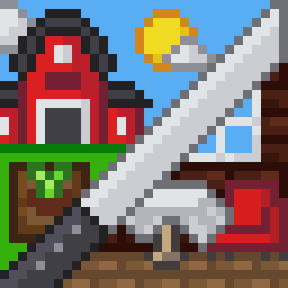

<p align="center"></p>

# Description
Tired of boring games with hundreds of convoluted mechanics and equally dull casual games? Then this game is exactly what you need!​

Madness Cooking is a game that blends cafe, kitchen, and farm simulators with absurd humor and charming pixel art. Get ready for PERFECTLY BALANCED gameplay, dozens of dishes and upgrades, and just as many puns!​

## Serve madness
Serve a wide variety of customers, climb the career ladder, and create your perfect cafe with the most profit possible. And don't forget to sleep, or you'll pass out and risk going bankrupt!

## Cook madness
Effortlessly cook Michelin-level dishes, as all it takes is pressing a couple of buttons. Keep an eye on your equipment's condition and at least occasionally repair it to avoid going bankrupt!

## Grow madness
You have an entire farm, where you can grow crops, water them and protect from pests, care for animals, 3D print meat, and sometimes catch ghosts. Buy absurd upgrades, expand your farm, and don’t forget to send everything to the kitchen on time to avoid going bankrupt!

## Buy madness
Buy new ingredients, dishes, equipment, and upgrades from the local equivalent of a soulless corporate browser! And if you're bored, try typing random stuff into the search bar — you might just find something interesting. Just don’t get too carried away, or you might risk going bankrupt!

# Run source code on local machine
If for some reason you want to dig into the source code or even improve it, then this instruction is for you.

- Install [Unity Hub](https://unity3d.com/en/get-unity/download)
- Clone repository

```shell
git clone https://github.com/Nytrock/MadnessCooking.git
```
- Open Unity Hub, click on the `Add project` button, select the folder where the repository was cloned
- Click on the created project and start studying the code
